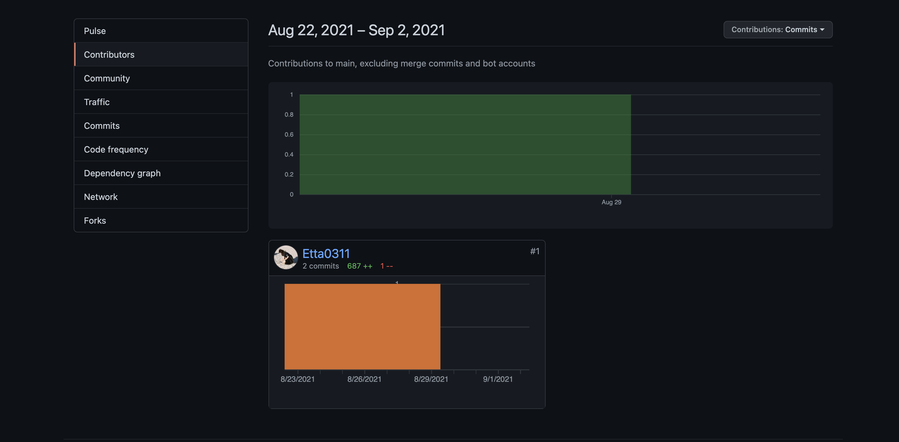

# Professional Portfolio

Links: [Etta's ePortfolio](https://etta0311.github.io/Professional-Portfolio/)

## Description
HTML and CSS helps me on building the basic elements needed for the website, and I added Javascript properties to my gallery as extras.
Thoughout the whole project, I was stucked at first on getting confuse about how the flexbox and div works,
this takes me for a few days to figure it out.
Been worried if i cannot finish this task on time and probably not able to master coming topics that is more difficult but yet,
I had a huge sense of accomplishment after it was done.

## Table of Contents

   - Techniques used
   - Features
   - Contributors
   - Credits
   - License

## Techniques used

   - Elements Such as header, footer, sections, asides etc. in html
   - Images alternative text
   - Class selectors
   - Building a Form
   - Slider Gallery building
   - Javascript

## Features

1. Front page & intro
   - when getting into the website, the intro description is not shown to viewers
   - The intro will pop up when hover is at front page section
   
   

2. Work
  - An image of lastest project shown on website and will navigate to the project if viewers click on it
  - Floating flexboxs added to indicate 
   

3. Flight Log Gallery
  - Images are grouped into one class and perform into a gallery
   

4. Contacts
  - Contacts Form on website allow viewers to leave a comment or question for me
   

## Contributors

   

## Credits
    - https://sydney.bootcampcontent.com/university-of-sydney/usyd-syd-fsf-pt-08-2021-u-c/-/blob/master/Unit-2-Advanced-CSS/02-Homework/README.md
    - https://coding-boot-camp.github.io/full-stack/github/professional-readme-guid
    - https://www.w3schools.com/howto/howto_js_slideshow.asp
    - https://www.w3.org/Style/Examples/007/fonts.en.html
    - https://htmlcolorcodes.com/
    - https://choosealicense.com/
    
## License
MIT License

Copyright (c) [2021] [Ettaho]

Permission is hereby granted, free of charge, to any person obtaining a copy
of this software and associated documentation files (the "Software"), to deal
in the Software without restriction, including without limitation the rights
to use, copy, modify, merge, publish, distribute, sublicense, and/or sell
copies of the Software, and to permit persons to whom the Software is
furnished to do so, subject to the following conditions:

The above copyright notice and this permission notice shall be included in all
copies or substantial portions of the Software.

THE SOFTWARE IS PROVIDED "AS IS", WITHOUT WARRANTY OF ANY KIND, EXPRESS OR
IMPLIED, INCLUDING BUT NOT LIMITED TO THE WARRANTIES OF MERCHANTABILITY,
FITNESS FOR A PARTICULAR PURPOSE AND NONINFRINGEMENT. IN NO EVENT SHALL THE
AUTHORS OR COPYRIGHT HOLDERS BE LIABLE FOR ANY CLAIM, DAMAGES OR OTHER
LIABILITY, WHETHER IN AN ACTION OF CONTRACT, TORT OR OTHERWISE, ARISING FROM,
OUT OF OR IN CONNECTION WITH THE SOFTWARE OR THE USE OR OTHER DEALINGS IN THE
SOFTWARE.
